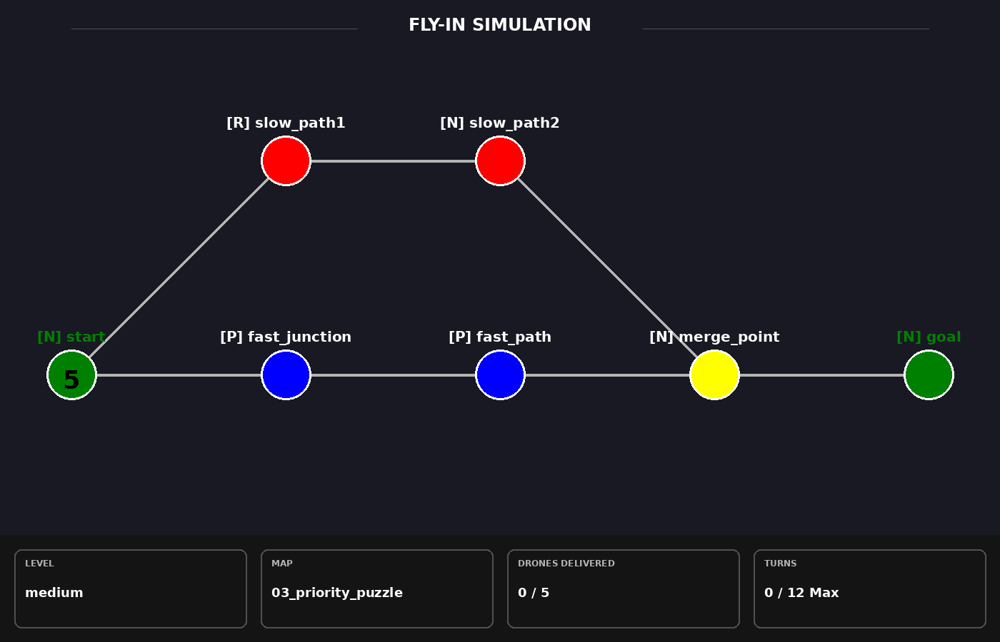
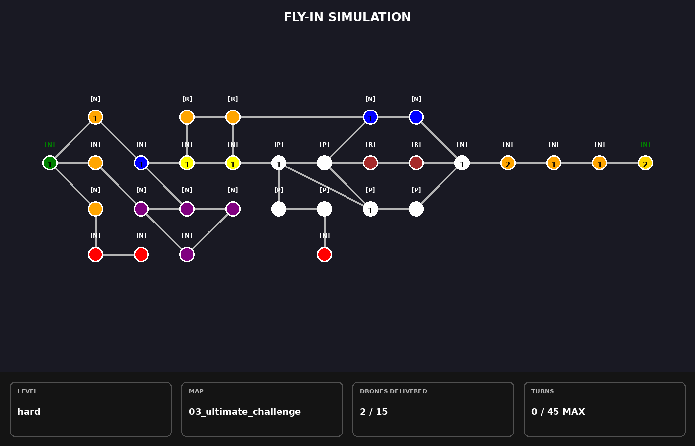

### *This project has been created as part of the 42 curriculum by sarfreit.*

# 🚁 Fly-in

<p align="center">
  
</p>

<p align="center">
  <i>Autonomous drone routing, turn-based simulation and animated visualization.</i>
</p>

---

# 📖 Description

**Fly-in** is a drone delivery simulation project developed in Python.

The objective is to transport a fleet of drones from a **Start Hub** to an **End Hub** through a network of interconnected zones while respecting movement constraints, capacities and routing rules.

The simulation executes turn by turn and calculates efficient routes using a pathfinding system inspired by **Dijkstra's shortest path algorithm**.

The project combines:

- Advanced map parsing and validation
- Turn-based simulation
- Autonomous drone routing
- Terminal visualization
- Animated GIF generation
- Frame-by-frame simulation analysis

---

# ✨ Features

✅ Map parser and validation system

✅ Turn-based drone simulation

✅ Dijkstra-inspired pathfinding

✅ Priority, Restricted and Blocked zones

✅ Capacity-aware routing

✅ Terminal visualization

✅ Automatic frame generation

✅ GIF animation generation using Pillow

✅ Extensive error handling and debugging support

✅ Detailed technical documentation

---

# ⚙️ Instructions

## Select a Map

Inside the Makefile:

```make
LEVEL = easy
MAP ?= 01_linear_path.txt
```

Change these values to choose the desired map (present in the assets folder).

Example:

```make
LEVEL = hard
MAP ?= 03_nightmare_maze.txt
```

---

## Install and Run the Project

After cloning this repository, type the following command:

```bash
make install
```

This will create the venv environment with all the necessary dependencies.
After that, just run the program with:

```bash
make run
```

The program will *display the simulation result on the terminal* with a small animation.

It will also create a *frame image per turn* until all drones have reached the end goal.
You can see this frames at the 'assets/frames' folder.
Not only that, you will also be able to see a *gif animation* on 'assets/gif', showing the whole animation in just a few seconds.


---

# 🗺 Explaining the concepts...

The simulator operates on custom map files describing hubs and their connections.

<p align="center">
  
</p>

Each map can define:

- Start Hub
- End Hub
- Intermediate hubs
- Zone types
- Zone colors
- Zone capacities
- Link capacities

---

# 🧠 Algorithm Strategy

The routing system is inspired by **Dijkstra's Shortest Path Algorithm**.

Instead of simply finding the shortest route, the simulator evaluates additional constraints such as:

- Zone type costs
- Occupied hubs
- Link availability
- Capacity restrictions
- Priority routing rules

### Zone Costs

| Zone Type | Cost |
|------------|--------|
| Normal | 1 |
| Priority | 1 |
| Restricted | 2 |
| Blocked | Not Traversable |

Restricted hubs remain usable but become less attractive due to their higher traversal cost.

Blocked hubs are completely ignored by the pathfinding system.

This approach allows drones to dynamically select efficient routes while adapting to simulation constraints.

---

# 🛰 Drone Rules

The simulation follows a simple set of rules:

- All drones start at the Start Hub.
- Drones move one hub per turn.
- Hub capacities must always be respected.
- Link capacities must always be respected.
- Blocked hubs cannot be traversed.
- Restricted hubs increase route cost.
- Drones continuously recalculate valid routes.
- The simulation ends when all drones reach the End Hub.

---

# 🎨 Visual Representation

One of the main goals of the project was to make the simulation easy to understand and debug.

The project provides two independent visualization systems.

<p align="center">
  
</p>

## Terminal Visualizer

The terminal renderer displays:

- Hub symbols
- Hub colors
- Drone movement
- Turn progression
- Final simulation report

This allows the simulation to be followed directly from the terminal.

---

## Pillow Animation System

An additional rendering system was implemented using **Pillow**.

Although Pillow is not required by the subject, it was added as a personal learning exercise and as a debugging tool.

The renderer generates:

- One PNG frame per simulation turn
- Drone counters per hub
- Simulation statistics
- Full animated GIF of the simulation

Benefits:

- Easier debugging by having a frame per turn
- Better understanding of drone movement
- Visual presentation of the algorithm
- Useful for documentation and demonstrations

---

# 🎞 Frame & GIF Generation

Every execution automatically recreates:

```text
assets/frames/
```

The folder is always deleted and regenerated from scratch each time the program is ran.

Each generated image represents a single simulation turn.

After all frames are created, they are combined into an animated GIF stored in:

```text
assets/gif/
```

The generated GIF provides a complete visual replay of the simulation.

---

# 📂 Project Structure

```text
src/
├── core/
│   ├── models.py
│   ├── Simulator.py
│   └── PathFinder.py
│
├── parsing/
│   └── MapParser.py
│
├── render/
│   ├── Visualizer.py
│   ├── ImageGenerator.py
│   └── constants.py
│
assets/
├── frames/
├── gif/
└── maps/
│
docs/
```

## 📦 core

Contains the main simulation logic.

### models.py

Defines the project's core data structures:

- Zone
- Connection
- Drone

### PathFinder.py

Responsible for route calculation and pathfinding.

Uses a Dijkstra-inspired approach adapted to simulation constraints.

### Simulator.py

Controls:

- Drone movement
- Turn execution
- Zone occupancy
- Link occupancy
- Simulation state tracking

---

## 📥 parsing

### MapParser.py

Loads and validates map files.

Responsible for:

- Syntax validation
- Connection validation
- Metadata parsing
- Coordinate validation
- Error reporting

---

## 🖼 render

### Visualizer.py

Terminal visualization system.

### ImageGenerator.py

Pillow-based rendering system.

Generates:

- PNG frames
- Simulation reports
- Animated GIFs

### constants.py

Stores:

- Colors
- Symbols
- Rendering constants
- Turn limits

---

## 📚 docs

Contains detailed project documentation.

Topics include:

- Parsing System
- Simulation Engine
- Pathfinding
- Dijkstra
- Rendering
- Design Decisions
- GIF Generation

---

# 📚 Additional Documentation

Detailed documentation is available in:

```text
docs/
```

This documentation provides a deeper explanation of:

- Parsing
- Drone Scheduling
- Simulation Engine
- Pathfinding Logic
- Dijkstra Algorithm
- Rendering Pipeline
- Design Decisions

---

# 📖 Resources

## Dijkstra's Algorithm

A Complete Guide to Dijkstra's Shortest Path Algorithm

https://www.codecademy.com/article/dijkstras-shortest-path-algorithm

---

## Pillow Documentation

https://pillow.readthedocs.io

---

## Python Documentation

https://docs.python.org/3/

---

# 🤖 AI Usage

AI tools were used as learning assistants throughout the development process.

They were primarily used for:

- Documentation drafting
- Architecture discussions
- Debugging assistance

---

# 🚀 Conclusion

Fly-in combines graph traversal, simulation systems, route optimization and visual rendering into a complete drone delivery simulator.

The project was designed not only to solve routing problems but also to provide clear visual feedback, making both debugging and understanding the simulation significantly easier.