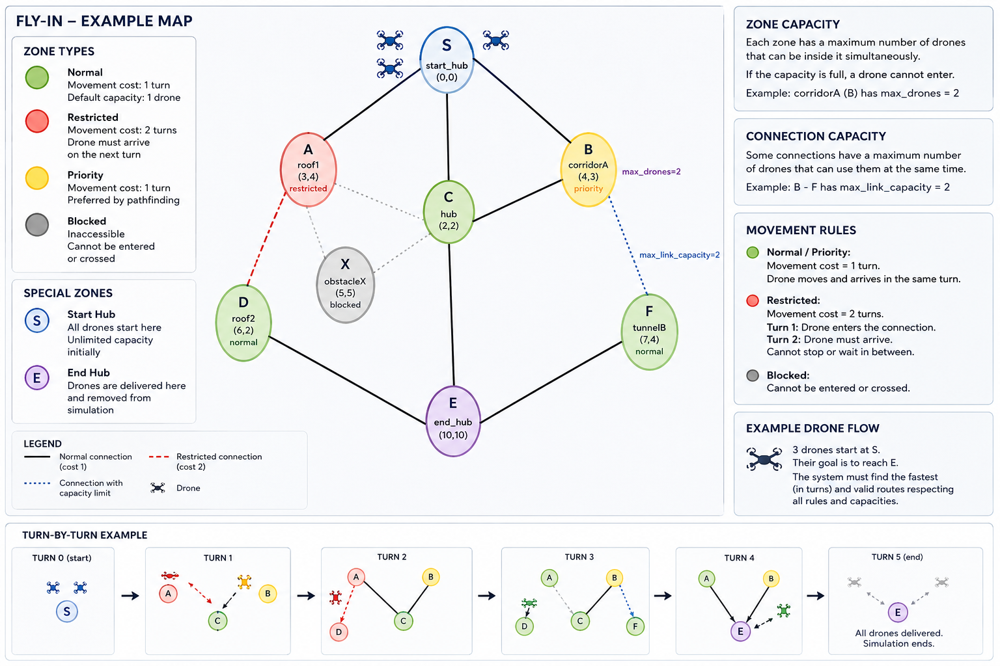

# 🛩️ Fly-in — Drone System Rules

# 📍 Zone System

Every map is composed of connected zones.



Each zone belongs to one of the following types:

---

| Zone Type | Description | Movement Cost | Special Rules |
|---|---|---|---|
| 🟢 `normal` | Default zone type | `1 turn` | - Default capacity: `1 drone`<br>- Drones may enter, leave and wait |
| 🔴 `restricted` | Sensitive or dangerous zone | `2 turns` | - Drone occupies the connection during transit<br>- Drone MUST arrive next turn<br>- Cannot stop or wait mid-connection<br>- Movement should not start if destination becomes unavailable |
| 🟡 `priority` | Preferred routing zone | `1 turn` | - Should be prioritized during pathfinding<br>- Behaves like a normal zone regarding occupancy |
| ⚫ `blocked` | Inaccessible zone | ❌ | - Drones cannot enter<br>- Drones cannot cross<br>- Any route using it is invalid |

---

# 📦 Zone Capacity Rules

| Rule | Description |
|---|---|
| Default capacity | Every zone supports `1 drone` unless specified otherwise |
| Custom capacity | Zones may define `max_drones=N` |
| Capacity restriction | A drone cannot enter a full zone |
| Simultaneous occupancy | Allowed only if capacity permits |

Example:

```txt
hub: corridorA 4 3 [max_drones=2]
```

Meaning:

```txt
Up to 2 drones may occupy the zone simultaneously.
```

---

# ✅ Special Zones

| Zone | Special Behaviour |
|---|---|
| `start_hub` | Unlimited drones may occupy it initially |
| `end_hub` | Unlimited drones may arrive and delivered drones stop being tracked |

---

# 🔗 Connection Rules

Connections define possible movement paths.

Example:

```txt
connection: A-B
```

---

# ↔️ Bidirectional Connections

All connections are:

- bidirectional

Meaning:

```txt
A-B
```

allows:

- A → B
- B → A

---

# 🚫 Invalid Connections

Connections are invalid if:

- one zone does not exist
- duplicated connection exists
- syntax is invalid

The following are duplicates:

```txt
A-B
B-A
```

---

# 📦 Connection Capacity

Connections may define:

```txt
[max_link_capacity=N]
```

Example:

```txt
connection: A-B [max_link_capacity=2]
```

Meaning:

```txt
Only 2 drones may traverse this connection simultaneously.
```

---

# 🚨 Connection Restrictions

A drone cannot use a connection if:

- its capacity would be exceeded
- another movement rule would be violated

---

# ⏱️ Turn System

The simulation is turn-based.

At every turn, each drone may:

- move
- wait
- continue restricted-zone transit

---

# 🚶 Movement Costs

| Destination Zone | Cost | Notes |
|---|---|---|
| `normal` | `1 turn` | Immediate movement |
| `priority` | `1 turn` | Should be preferred during pathfinding |
| `restricted` | `2 turns` | Drone occupies connection during transit |
| `blocked` | ❌ | Cannot be entered |

---

# 🛫 Restricted Movement Rules

Restricted movement behaves differently from normal movement.

## Turn 1

The drone enters transit state.

Example:

```txt
D1-A-B
```

---

## Turn 2

The drone MUST arrive at destination.

The drone cannot:

- cancel movement
- wait on the connection
- pause transit

---

# 🔄 Simultaneous Movement Rules

Multiple drones may move during the same turn.

BUT:

- zone capacities must be respected
- connection capacities must be respected
- collisions must not happen

---

# 🚨 Occupancy Rules

Two drones cannot:

- enter the same zone simultaneously

unless:

```txt
max_drones > 1
```

---

# 🔓 Freeing Space

When a drone leaves a zone:

- that space becomes available during the same turn

This means movement scheduling matters.

---

# 🧠 Pathfinding Logic Rules

The routing system must consider:

- shortest paths
- movement costs
- restricted zones
- priority zones
- occupancy limits
- connection limits
- simultaneous drone movement

---

# 🚫 Invalid Drone Behaviour

A drone must never:

- enter blocked zones
- exceed zone capacity
- exceed connection capacity
- remain inside restricted transit longer than allowed
- teleport
- skip turns illegally
- use undefined connections

---

# 📄 Output Rules

Every line represents:

```txt
1 simulation turn
```

Format:

```txt
D<ID>-<destination>
```

Example:

```txt
D1-roof1 D2-corridorA
```

---

# 🛫 Restricted Transit Output

While travelling toward restricted zones:

```txt
D<ID>-<connection>
```

may be displayed.

Example:

```txt
D1-A-B
```

---

# 🏁 End Conditions

Simulation ends only when:

- every drone reaches `end_hub`

Delivered drones:

- are removed from active simulation tracking.

---

# 🎯 Optimization Goal

Main objective:

```txt
Minimize total simulation turns
```

The algorithm should:

- maximize throughput
- reduce waiting
- avoid deadlocks
- distribute drones efficiently across paths